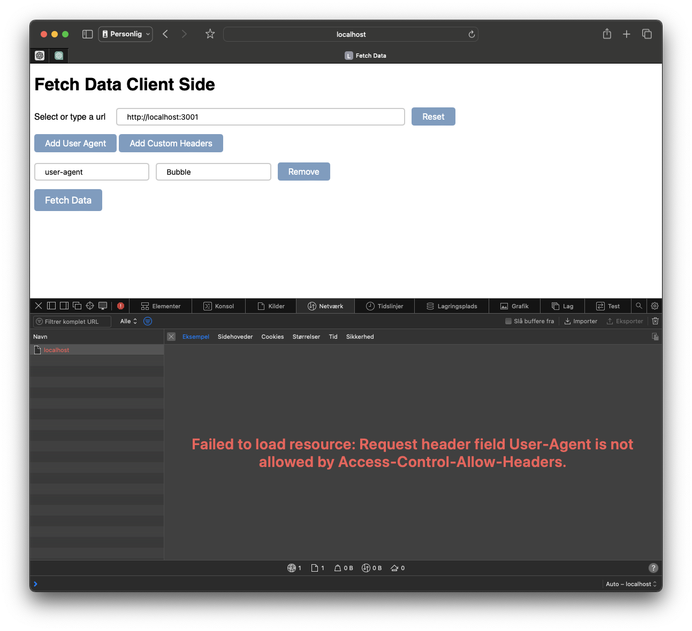

# CORS test

## Run

```bash
npm install
npm start
```

## Test

The start script will run a client and a server.

The client is available at [http://localhost:8080](http://localhost:8080) and the server at [http://localhost:3001](http://localhost:3001).

From the client you can make a request to the server (choose localhost in the dropdown), or write a custom url.

You can append headers to the request to see how this affects the response.

While the server and client is running, you can alter the CORS headers in src/server/index.js and see how this affects the responses.


